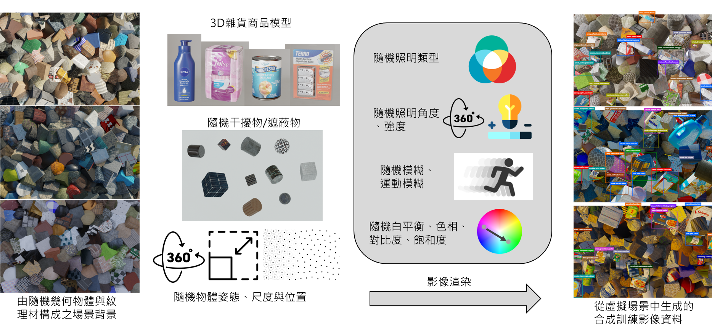

<p align="center">

</p>

# 應用合成資料訓練物件偵測模型進行零售商品辨識 

訓練卷積神經網絡模型需要大量標記的訓練資料才能獲得良好的性能，而訓練資料的收集和標記是一個昂貴、耗時且容易出錯的過程。克服這一限制的一種有前途的方法是使用電腦合成影像(Computer Generated Imagery, CGI)技術建立一個虛擬環境來生成合成資料與進行自動標記。

## **1. 專案概述** 

Synthetic Data Generator for Retail Products Detection是一個開源專案，旨在以Blender與Python建構一個合成影像資料生成管道，生成的合成資料被用來訓練YOLOv5模型並應用於零售商品辨識用途。此專案利用Blender生成了包含63種零售商品(例如: 麥片盒、可樂鋁罐等)的隨機化合成圖像，並導出對應的資料標籤與標註(2D偵測框，YOLO格式)。

本開源專案提供了以下資源:
* 數位資產 - 63種零售商品的3D模型(.blend)，可由此[Google Drive]()下載。
* 數位資產 - 1369種PBR材質(.jpg)，這些材質來自ambientCG網站，可由此Google Drive下載。
* 數位資產 - 561種HDRI照明貼圖(.exr)，這些照明貼圖來自PolyHaven網站，可由此Google Drive下載。
* 數位資產 - 充當背景與干擾物的無材質幾何3D模型(.blend)，可由此Google Drive下載。
* 程式碼 - 合成影像資料生成器(SDG)，一個以Blender與Python建構的合成影像資料生成管道。
* 真實零售商品影像資料集 - 1267張真實零售商品影像資料集，此資料集來自UnityGroceries-Real Dataset，其資料標籤為YOLO格式，可由此[Google Drive](https://drive.google.com/file/d/1RPFCBf4z7A4NkskV6Jn1MYwirZqf_qtR/view?usp=sharing)下載。


## **2. 合成資料生成管道介紹**


*合成資料生成管道的流程*

 
*相機效果生成的流程*


<p align="center">

</p>

<p align="center">

</p>

## **3. 數位資產配置與生成管道參數設定** 

<p align="center">

</p>

<p align="center">

</p>

<p align="center">

</p>

```python
class SDGParameter:
    """A configuration class to configure this blender-based synthetic data generator pipeline.

    Attributes
    ----------
    gen_num (int): The quantity of synthetic images needed to be generated.
    blender_exe_path (str): The path to the blender executable[1].
    asset_background_object_folder_path (str): The path to background object assets.
    asset_foreground_object_folder_path (str): The path to foreground object assets.
    asset_ambientCGMaterial_folder_path (str): The path to the downloaded ambientCG PBR materials.
    asset_hdri_lighting_folder_path (str): The path to the downloaded Poly Haven HDRIs.
    asset_occluder_folder_path (str): The path to occlusion object assets.
    output_img_path (str): The path where rendered images will be saved.
    output_label_path (str): The path where YOLO format bounding box annotations will be saved.
    background_poisson_disk_sampling_radius (float): Background objects separation distance.
    num_foreground_object_in_scene_range (dict of str: int): The distribution of the number of retail items within the blender scene.
    foreground_area (list of float): Spatial distribution area of foreground objects.
    foreground_poisson_disk_sampling_radius (float): Foreground objects separation distance.
    num_occluder_in_scene_range (dict of str: int): The distribution of the number of occlusion objects within the blender scene.
    occluder_area (list of float): Spatial distribution area of occlusion objects.
    occluder_poisson_disk_sampling_radius (float): Occlusion objects separation distance.
    bg_obj_scale_ratio_range (dict of str: float): The distribution of the scale ratio of background objects within the blender scene.
    fg_obj_scale_ratio_range (dict of str: float): The distribution of the scale ratio of foreground objects within the blender scene.
    occluder_scale_ratio_range (dict of str: float): The distribution of the scale ratio of occluder objects within the blender scene.
    hdri_lighting_strength_range (dict of str: float): The distribution of the strength factor for the intensity of the HDRI scene light.
    img_resolution_x (int): Number of horizontal pixels in the rendered image.
    img_resolution_y (int): Number of vertical pixels in the rendered image.
    max_samples (int): Number of samples to render for each pixel.
    chromatic_aberration_probability (float): Probability of chromatic aberration effect being enabled.
    blur_probability (float): Probability of blur effect being enabled.
    motion_blur_probability (float): Probability of motion blur effect being enabled.
    exposure_probability (float): Probability of exposure adjustment being enabled.
    noise_probability (float): Probability of noise effect being enabled.
    white_balance_probability (float): Probability of white balance adjustment being enabled.
    brightness_probability (float): Probability of brightness adjustment being enabled.
    contrast_probability (float): Probability of contrast adjustment being enabled.
    hue_probability (float): Probability of hue adjustment being enabled.
    saturation_probability (float): Probability of saturation adjustment being enabled.
    chromatic_aberration_value_range (dict of str: float): The distribution of the value of Lens Distortion nodes input-Dispersion, which simulates chromatic aberration.
    blur_value_range (dict of str: int): The distribution of the value of Blur nodes input-Size, which controls the blur radius values.
    motion_blur_value_range (dict of str: int): The distribution of the value of Vector Blur nodes input-Speed, which controls the direction of motion.
    exposure_value_range (dict of str: float): The distribution of the value of Exposure nodes input-Exposure, which controls the scalar factor to adjust the exposure.
    noise_value_range (dict of str: float): The distribution of the value of brightness of the noise texture.
    white_balance_value_range (dict of str: int): The distribution of the value of WhiteBalanceNode input-ColorTemperature, which adjust the color temperature.
    brightness_value_range (dict of str: float): The distribution of the value of Bright/Contrast nodes input-Bright, which adjust the brightness.
    contrast_value_range (dict of str: float): The distribution of the value of Bright/Contrast nodes input-Contrast, which adjust the contrast.
    hue_value_range (dict of str: float): The distribution of the value of Hue Saturation Value nodes input-Hue, which adjust the hue.
    saturation_value_range (dict of str: float): The distribution of the value of Hue Saturation Value nodes input-Saturation, which adjust the saturation.

    """
        def __init__(self):
        self.gen_num = 2
        self.blender_exe_path = "C:/program Files/Blender Foundation/Blender 3.3/blender"
        self.asset_background_object_folder_path = "C:/Users/user/Documents/project/Synthetic-Data-Generator-for-Retail-Products-Detection/Assets/background_object"
        self.asset_foreground_object_folder_path = "C:/Users/user/Documents/project/Synthetic-Data-Generator-for-Retail-Products-Detection/Assets/foreground_object"
        self.asset_ambientCGMaterial_folder_path = "C:/Users/user/Documents/project/Synthetic-Data-Generator-for-Retail-Products-Detection/Assets/texture"
        self.asset_hdri_lighting_folder_path = "C:/Users/user/Documents/project/Synthetic-Data-Generator-for-Retail-Products-Detection/Assets/HDRI"
        self.asset_occluder_folder_path = "C:/Users/user/Documents/project/Synthetic-Data-Generator-for-Retail-Products-Detection/Assets/occluder"
        self.output_img_path = "C:/Users/user/Documents/project/Synthetic-Data-Generator-for-Retail-Products-Detection/gen_data/images"
        self.output_label_path = "C:/Users/user/Documents/project/Synthetic-Data-Generator-for-Retail-Products-Detection/gen_data/labels"
        self.background_poisson_disk_sampling_radius = 0.2
        self.num_foreground_object_in_scene_range = {"min": 8 ,"max": 20}
        self.foreground_area = [2.5, 1.5, 0.5]
        self.foreground_poisson_disk_sampling_radius = 0.3
        self.num_occluder_in_scene_range = {"min": 5 , "max": 10} # !!maximum : 20
        self.occluder_area = [1.2, 0.8, 0.4]
        self.occluder_poisson_disk_sampling_radius = 0.25
        self.bg_obj_scale_ratio_range = {"min": 2.5, "max": 2.5}
        self.fg_obj_scale_ratio_range = {"min": 0.5, "max": 2.5}
        self.occluder_scale_ratio_range = {"min": 0.5, "max": 1.5}
        self.hdri_lighting_strength_range = {"min": 0.2 , "max": 2.2}
        self.img_resolution_x = 1728
        self.img_resolution_y = 1152
        self.max_samples = 256
        self.chromatic_aberration_probability = 0.1
        self.blur_probability = 0.1
        self.motion_blur_probability = 0.1
        self.exposure_probability = 0.15
        self.noise_probability = 0.1
        self.white_balance_probability = 0.15
        self.brightness_probability = 0.15
        self.contrast_probability = 0.15
        self.hue_probability = 0.15
        self.saturation_probability = 0.15
        self.chromatic_aberration_value_range = {"min": 0.1, "max": 1}
        self.blur_value_range = {"min": 2, "max": 4}
        self.motion_blur_value_range = {"min": 2, "max": 7}
        self.exposure_value_range = {"min": -0.5, "max": 2}
        self.noise_value_range = {"min": 1.6, "max": 1.8}
        self.white_balance_value_range = {"min": 3500, "max": 9500}
        self.brightness_value_range = {"min": -1.0, "max": 1.0}
        self.contrast_value_range = {"min": -1.0, "max": 5.0}
        self.hue_value_range =  {"min": 0.45, "max": 0.55}
        self.saturation_value_range = {"min": 0.75, "max": 1.25}

```
## **4. YOLOv5模型訓練及結果** 

